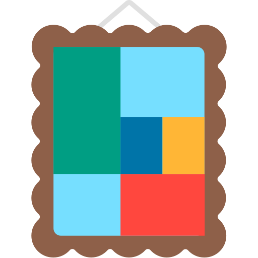

  

# Gallery

Bluesnooze prevents your sleeping Mac from connecting to Bluetooth accessories.

A platform for storing and organising information and documentation. Details for BookStack can be found on the official website at https://www.bookstackapp.com/.

Made with [Electron](https://github.com/electron/electron), [SvelteKit](https://github.com/sveltejs/kit) and [Skeleton](https://github.com/skeletonlabs/skeleton).

  <i>Insert future screenshot here</i>

## About

If you pair Bluetooth headphones or speakers with both your phone & Mac it can be frustrating when your sleeping Mac connects intermittently and disrupts the audio.

With Bluesnooze the Bluetooth connection is switched off when your Mac sleeps, and switched on when your Mac wakes.

BookStack is an opinionated wiki system that provides a pleasant and simple out-of-the-box experience. New users to an instance should find the experience intuitive and only basic word-processing skills should be required to get involved in creating content on BookStack. The platform should provide advanced power features to those that desire it but they should not interfere with the core simple user experience.

BookStack is not designed as an extensible platform to be used for purposes that differ to the statement above.

In regard to development philosophy, BookStack has a relaxed, open & positive approach. At the end of the day this is free software developed and maintained by people donating their own free time.

## Features

- [ ] Uninstall/Disable and Restore/Enable system packages
- [ ] Multi-user support (e.g apps in work profiles)
- [ ] Export/Import your selection in uad_exported_selection.txt
- [ ] Multi-device support: you can connect multiple phones at the same time
- [ ] All your actions are logged so you never forget what you've done

## License

Source code provided under the [CC-BY-SA-4.0 license](https://github.com/tseignette/gallery/blob/main/LICENSE)

Logo from [FxEmojis](https://github.com/mozilla/fxemoji) by Firefox
